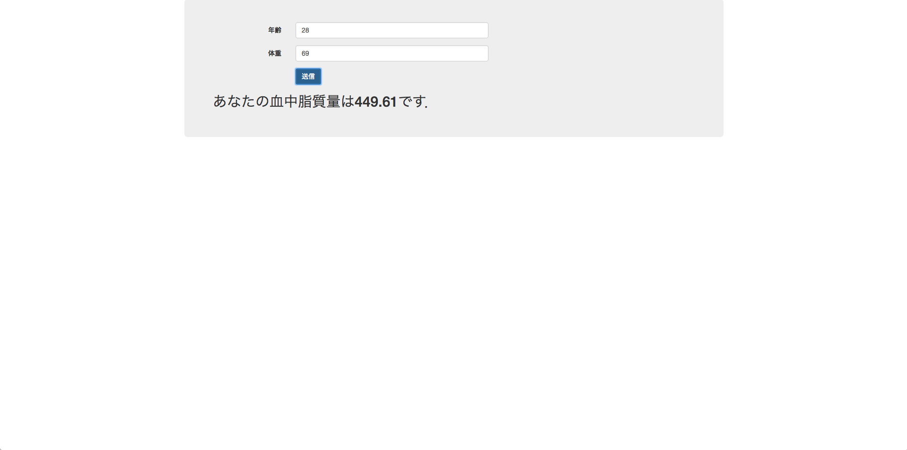

Flaskを用いたWebアプリケーション

参考: [Pythonデータサイエンス](https://www.amazon.co.jp/dp/B01N9FNAQ0/ref=dp-kindle-redirect?_encoding=UTF8&btkr=1)

# 必要環境
* Python 3.5.1
* Flask 0.12.1
* scikit-learn 0.18.1
* pandas 0.19.2

# 実行方法
```
# アプリケーションを実行
python app.py
```

http://localhost:5000  にアクセスすると，以下のWebアプリケーションが実行可能


